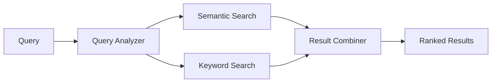

# Hybrid Search System

A sophisticated search system that combines semantic and keyword search capabilities with Arabic-English language support. The system uses sentence transformers for semantic understanding and TF-IDF for exact keyword matching, with intelligent query analysis to optimize search strategies.

## 🚀 Features

- **Hybrid Search**: Combines semantic (FAISS) and keyword (TF-IDF) search
- **Smart Query Analysis**: Automatically detects short queries (like "COMI") and adjusts search strategy
- **Arabic-English Support**: Handles multilingual content with proper text processing
- **REST API**: FastAPI-based REST endpoints for easy integration
- **Modular Architecture**: Clean, maintainable code following Single Responsibility Principle
- **Caching System**: Intelligent caching of embeddings and indices for performance
- **CLI Interface**: Command-line interface for direct interaction

## 🏗️ Architecture

The system follows a modular architecture with clear separation of concerns:

```
├── Data Layer (data_loader.py, text_processor.py)
├── Model Layer (model_manager.py, file_manager.py)
├── Search Layer (semantic_index.py, keyword_index.py)
├── Logic Layer (query_analyzer.py, hybrid_searcher.py)
├── Presentation Layer (result_formatter.py, api_*)
└── Interface Layer (main.py, run_api.py)
```

## 📋 Prerequisites

- Python 3.8+
- 4GB+ RAM (for model loading)
- CSV data file with `TITLE` and `DESCRIPTION` columns

## 🛠️ Installation

1. **Clone the repository**
   ```bash
   git clone https://github.com/yourusername/hybrid-search-system.git
   cd hybrid-search-system
   ```

2. **Create virtual environment**
   ```bash
   python -m venv venv
   
   # Windows
   venv\Scripts\activate
   
   # Linux/Mac
   source venv/bin/activate
   ```

3. **Install dependencies**
   ```bash
   # For CLI only
   pip install -r requirements.txt
   
   # For CLI + API
   pip install -r requirements_api.txt
   ```

4. **Prepare your data**
   - Place your CSV file as `data.csv` in the project root
   - Ensure it has `TITLE` and `DESCRIPTION` columns
   - Optional: `MOD_DATE`, `SOURCE_NAME` columns for metadata

## 🚀 Quick Start

### CLI Usage

```bash
# Start interactive search
python main.py

# Search directly
💬 Search: COMI
```

### API Usage

```bash
# Start API server
python run_api.py --csv data.csv --port 8000

# Health check
curl http://localhost:8000/health

# Search
curl "http://localhost:8000/search?q=COMI&top_k=5"
```

## 📖 Usage Examples

### 1. Basic Search
```bash
# CLI
python main.py
💬 Search: financial analysis

# API
curl "http://localhost:8000/search?q=financial%20analysis&top_k=10"
```

### 2. Short Query (Acronym) Search
```bash
# The system automatically detects "COMI" as a short query
# and uses 70% keyword + 30% semantic weighting
💬 Search: COMI
```

### 3. API Response Format
```json
{
  "query": "COMI",
  "strategy": "30% semantic + 70% keyword (keyword-focused)",
  "total_results": 5,
  "results": [
    {
      "result_number": 1,
      "title": "COMI Project Update",
      "date": "2024-01-15",
      "source": "Internal",
      "summary": "Latest updates on the COMI initiative...",
      "score": 0.8542
    }
  ],
  "execution_time_ms": 45.6
}
```

## 🔧 Configuration

### Model Configuration
Edit `model_manager.py` to change the sentence transformer model:
```python
MODEL_OPTIONS = [
    "sentence-transformers/all-MiniLM-L6-v2",  # Default: Fast, good quality
    "sentence-transformers/all-mpnet-base-v2", # Better quality, slower
    "sentence-transformers/paraphrase-multilingual-MiniLM-L12-v2"  # Multilingual
]
```

### Search Strategy
Modify `query_analyzer.py` to adjust search weighting:
```python
def get_search_weights(query):
    if QueryAnalyzer.is_short_query(query):
        return {
            'semantic_weight': 0.3,  # Adjust these weights
            'keyword_weight': 0.7,
            'strategy': 'keyword-focused'
        }
```

## 📁 Project Structure

```
hybrid-search-system/
├── 📊 Data Processing
│   ├── data_loader.py          # CSV data loading and validation
│   └── text_processor.py       # Text cleaning and preprocessing
├── 🤖 Model Management
│   ├── model_manager.py        # Sentence transformer management
│   └── file_manager.py         # File I/O and caching
├── 🔍 Search Engines
│   ├── semantic_index.py       # FAISS semantic search
│   └── keyword_index.py        # TF-IDF keyword search
├── 🧠 Intelligence Layer
│   ├── query_analyzer.py       # Query analysis and strategy
│   ├── hybrid_searcher.py      # Search coordination
│   └── result_formatter.py     # Result formatting
├── 🌐 API Layer
│   ├── api_models.py           # Pydantic models
│   ├── api_routes.py           # FastAPI route handlers
│   ├── api_server.py           # FastAPI application
│   ├── search_service.py       # Search business logic
│   └── run_api.py              # API server runner
├── 🖥️ Interface
│   └── main.py                 # CLI interface
├── 📋 Documentation
│   ├── README.md               # This file
│   ├── diagrams/               # System diagrams
│   └── flowchart.md            # Process flowcharts
└── ⚙️ Configuration
    ├── requirements.txt        # Core dependencies
    ├── requirements_api.txt    # API dependencies
    └── .gitignore             # Git ignore rules
```

## 🔄 How It Works

### 1. Smart Query Analysis
- **Short queries** (≤6 chars, like "COMI"): 70% keyword + 30% semantic
- **Long queries**: 70% semantic + 30% keyword
- Prevents issues like "COMI" being interpreted as Spanish "comí"

### 2. Parallel Search Execution


### 3. Intelligent Caching
- **Embeddings**: Cached as `embeddings.npy`
- **FAISS Index**: Cached as `faiss.index`
- **TF-IDF Matrix**: Cached as `tfidf_matrix.npz`
- **Vocabulary**: Cached as `tfidf_vocab.npy`

## 🚀 API Endpoints

| Endpoint | Method | Description | Parameters |
|----------|--------|-------------|------------|
| `/health` | GET | System health check | None |
| `/search` | GET | Search documents | `q` (query), `top_k` (limit) |

### Health Check Response
```json
{
  "status": "healthy",
  "message": "Search system is running",
  "documents_loaded": 36197,
  "search_capabilities": {
    "semantic_available": true,
    "keyword_available": true,
    "hybrid_mode": true
  }
}
```

## 🔧 Troubleshooting

### Common Issues

1. **Model Download Fails**
   ```bash
   # Clear cache and retry
   rm -rf ~/.cache/huggingface/
   python main.py
   ```

2. **Memory Error**
   - Reduce `max_features` in `keyword_index.py`
   - Use smaller sentence transformer model
   - Process data in smaller batches

3. **No Search Results**
   - Check CSV file has required columns
   - Verify data is not empty
   - Check health endpoint: `/health`

4. **Import Errors**
   ```bash
   # Debug imports
   python debug_imports.py
   ```

### Performance Optimization

- **For large datasets (100K+ docs)**: Use `faiss-gpu` instead of `faiss-cpu`
- **For memory constraints**: Reduce `max_features` in TF-IDF
- **For speed**: Use smaller embedding models

## 🤝 Contributing

1. Fork the repository
2. Create a feature branch (`git checkout -b feature/amazing-feature`)
3. Commit your changes (`git commit -m 'Add amazing feature'`)
4. Push to the branch (`git push origin feature/amazing-feature`)
5. Open a Pull Request

### Development Setup
```bash
# Install development dependencies
pip install -r requirements_api.txt

# Run tests
python -m pytest tests/

# Run linting
flake8 .
black .
```

## 📄 License

This project is licensed under the MIT License - see the [LICENSE](LICENSE) file for details.

## 🙏 Acknowledgments

- **Sentence Transformers** for semantic embeddings
- **FAISS** for efficient similarity search
- **FastAPI** for the REST API framework
- **scikit-learn** for TF-IDF implementation


## 🗺️ Roadmap

- [ ] Support for more languages (French, German, etc.)
- [ ] Real-time indexing for dynamic data
- [ ] Advanced query preprocessing
- [ ] Integration with Elasticsearch
- [ ] Web-based UI interface
- [ ] Docker containerization
- [ ] Kubernetes deployment configs

---

**Made with ❤️ for better search experiences**